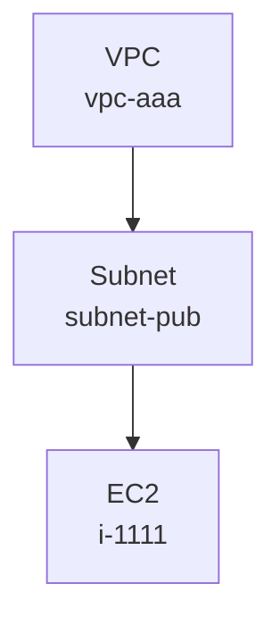

# clew

> *A clew through your AWS Config labyrinth.*

`clew` は AWS Config の Configuration Snapshot を読み込んで、リソースをノード・リソース間の関係をエッジとしてローカルの DuckDB に保存し、最終的にインタラクティブな HTML(Cytoscape.js + dagre、compound nodes で VPC > Subnet > インスタンスの入れ子構造を表現)/ Graphviz 画像 (SVG / PNG) / Mermaid テキストとして出力する Go 製 CLI です。最初は VPC ネットワーク構成の可視化に焦点を当てています。

ツール名 *clew* は古英語で「糸玉」を意味する語で、現代英語 *clue*(手がかり)の語源でもあります。ギリシャ神話でアリアドネがテセウスに渡し、迷宮を抜けるための糸 — つまり **散らばった構成情報の中から手がかりを辿るための糸**、というのが命名の由来です。

---

## 必要要件

- Go 1.21+ (実装は 1.26 で動作確認)
- CGO 有効 (`CGO_ENABLED=1`)。`marcboeker/go-duckdb` は CGO に依存するため macOS/Linux ともに C コンパイラ (`cc` / `clang`) が必要です。
- AWS CLI (snapshot を取得する場合のみ)
- AWS Config が有効化されたアカウント (snapshot を取得する場合のみ)

## ビルド

```sh
git clone https://github.com/nishikawaakira/clew.git
cd clew
go build -o clew .
```

ローカル実行のみで配布バイナリを作らない場合は `go run . <subcommand>` でも構いません。

テストの実行:

```sh
go test ./...
```

---

## AWS Config Snapshot のダウンロード手順

AWS Config の Configuration Snapshot は、有効化済みアカウントから S3 バケットへ定期 (通常 6 時間ごと) に配信されます。即時に必要な場合は `deliver-config-snapshot` を呼び出して配信をトリガーします。

### 1. AWS Config が有効化されているか確認

```sh
aws configservice describe-configuration-recorders
aws configservice describe-delivery-channels
```

`ConfigurationRecorders` と `DeliveryChannels` が両方返ってくれば有効化済みです。返ってこない場合はマネジメントコンソールから「設定」→「AWS Config を有効化」を行ってください (CLI で行う場合は `put-configuration-recorder` / `put-delivery-channel` / `start-configuration-recorder` を順に実行)。

### 2. 配信先 S3 バケット名を確認

```sh
aws configservice describe-delivery-channels \
  --query 'DeliveryChannels[0].[name,s3BucketName,s3KeyPrefix]' \
  --output text
```

- `name` — Delivery channel 名 (デフォルトは `default`)
- `s3BucketName` — 配信先バケット
- `s3KeyPrefix` — 任意のプレフィックス (未設定なら空)

### 3. Snapshot 配信を即時トリガー

```sh
aws configservice deliver-config-snapshot \
  --delivery-channel-name default
```

レスポンスとして `configSnapshotId` が返ります。配信は非同期で、S3 に現れるまで通常 10〜60 秒ほどかかります。

> 必要な IAM 権限: `config:DeliverConfigSnapshot`, `config:DescribeDeliveryChannels`, `config:DescribeConfigurationRecorders`

### 4. S3 から snapshot をダウンロード

snapshot は以下のキー形式で配置されます。

```
s3://<bucket>/<optional-prefix>/AWSLogs/<account-id>/Config/<region>/<yyyy>/<mm>/<dd>/ConfigSnapshot/<account-id>_Config_<region>_ConfigSnapshot_<timestamp>_<snapshot-id>.json.gz
```

例 (リージョン配下から最新の snapshot を 1 件取得):

```sh
ACCOUNT_ID=$(aws sts get-caller-identity --query Account --output text)
REGION=ap-northeast-1
BUCKET=<your-bucket>
PREFIX="AWSLogs/${ACCOUNT_ID}/Config/${REGION}/"

# 当該リージョン以下の snapshot 一覧 (新しいものほど末尾)
aws s3 ls "s3://${BUCKET}/${PREFIX}" --recursive \
  | grep ConfigSnapshot | sort

# 最新の 1 件をダウンロード
KEY=$(aws s3 ls "s3://${BUCKET}/${PREFIX}" --recursive \
        | grep ConfigSnapshot | sort | tail -n 1 | awk '{print $4}')
aws s3 cp "s3://${BUCKET}/${KEY}" ./snapshot.json.gz
```

AWS Config の S3 キーは月日が zero-pad されない形式 (`.../2026/5/20/...`) のため、シェルの `date` フォーマットに依存せず `--recursive` で列挙して `grep ConfigSnapshot | sort | tail` する方が macOS/Linux 共に安全です。

> 必要な IAM 権限: `s3:ListBucket`, `s3:GetObject` (対象バケット／キー)

### 5. (任意) ローカルで展開して中身を確認

```sh
gunzip -k snapshot.json.gz
jq '.configurationItems | length' snapshot.json
jq '.configurationItems[0]' snapshot.json
```

`clew import` は `.json` と `.json.gz` のいずれも受け付けるので展開する必要はありません。

---

## 使い方

### import — DuckDB に取り込む

```sh
clew import \
  --input snapshot.json.gz \
  --db config.duckdb
```

- `--input` は `.json` / `.json.gz` のいずれも可 (内容を見て自動判定)
- `--db` が存在しなければ新規作成、存在すれば追記
- **冪等性**:同じ snapshot を同じ DB に再 import しても重複行は発生しません
  - `config_items.item_id` は `account_id:aws_region:resource_type:resource_id:captureTime` 形式の PRIMARY KEY で、INSERT は `ON CONFLICT (item_id) DO NOTHING`。**同一 snapshot の二度目の import は no-op** です
  - 一方、**異なる時刻に取得した snapshot** を同じ DB に import すると、同じリソースが別 `item_id` の行として保存されるため履歴を辿れます
  - `graph_nodes` / `graph_edges` は常に最新状態を表します(real ノードは UPSERT、placeholder / edge は DO NOTHING)

### render — 構成図を出力する

```sh
# インタラクティブ HTML (推奨。ズーム / パン / ノードクリックで詳細表示)
clew render --db config.duckdb --view vpc --format html --output vpc.html
open vpc.html   # ブラウザで開く

# 静的 SVG (GitHub / Markdown の図として添付したい場合)
clew render --db config.duckdb --view vpc --format svg --output vpc.svg

# PNG (Slack / Notion / スライド貼り付け向け)
clew render --db config.duckdb --view vpc --format png --output vpc.png

# Mermaid (Markdown 内に埋め込む / mermaid.live で開く)
clew render --db config.duckdb --view vpc --format mermaid --output vpc.md

# Graphviz DOT (他ツールで再加工したい場合)
clew render --db config.duckdb --view vpc --format dot --output vpc.dot
```

- 現状サポートしている view は `vpc` のみ
- `--format` は `html` / `mermaid` / `dot` / `svg` / `png` / `jpg` (デフォルト: `html`)
- `--output` を省略すると標準出力。`png` / `jpg` はターミナルが化けないように `--output` 必須
- `--with-edge-labels` を付けるとエッジに relationship 名が付きます (HTML は UI トグルでも切替可)
- `--layout` で Graphviz レイアウトエンジン (`dot` / `neato` / `fdp` / `circo` / `twopi`) を切替可能。HTML/Mermaid では無視されます

**形式の選び方**

| 形式 | 推奨用途 | 特徴 |
|---|---|---|
| `html` | 自分でグラフを眺めて理解したい | **VPC が外箱、Subnet が内箱、その中にインスタンス**(compound nodes)というアーキテクチャ図風の配置。`dagre` でレイヤ整列、ズーム / パン / ノードクリックで詳細表示 / レイアウト方向 (TB/LR/BT/RL) 切替。Cytoscape.js + cytoscape-dagre を CDN ロードするのでブラウザ閲覧にネット接続が必要 |
| `svg` | ドキュメントに静的に貼りたい | ベクター。GitHub / ブラウザで開ける |
| `png` / `jpg` | Slack / Notion / スライド | ラスタ。サイズ固定 |
| `mermaid` | Markdown 内に直接埋め込みたい | GitHub README などはそのまま図として描画 |
| `dot` | Graphviz の別ツール (gephi 等) で再加工 | テキスト |

画像系 (`svg` / `png` / `jpg` / `dot`) は `goccy/go-graphviz` 経由の WASM 同梱 Graphviz でレンダリングします。**外部の `graphviz` インストールは不要** です。HTML は単一ファイルで完結し、ブラウザで開いたときに Cytoscape.js / dagre / cytoscape-dagre を CDN から読み込みます (オフラインで開きたい場合は将来オプションを追加予定)。

Mermaid 出力例:

````markdown

````

### query — 特定リソースの周辺を確認する

```sh
clew query \
  --db config.duckdb \
  --resource-id vpc-aaa \
  --depth 2 \
  --format html \
  --output vpc-neighborhood.html
```

- `--depth 0` は seed のみ
- `--format` は `html` / `mermaid` / `dot` / `svg` / `png` / `jpg` / `text` を切替可 (デフォルト: `html`)
- `--with-edge-labels` は HTML / Mermaid / Graphviz でデフォルト on
- `text` は端末向けのプレーンテキストサマリです

---

## データモデル

DuckDB に作成されるテーブル:

| テーブル | 用途 |
|---|---|
| `config_items` | 取り込んだ configurationItem ごとの raw / configuration / relationships / tags |
| `graph_nodes` | リソース 1 件 = 1 row (placeholder を含む) |
| `graph_edges` | リソース間関係 (relationship 由来 + configuration 由来) |

`node_id` の形式: `account_id:aws_region:resource_type:resource_id`
`edge_id`: `SHA256(source_node_id | relationship_name | target_node_id)`
`config_items.item_id` の形式: `account_id:aws_region:resource_type:resource_id:captureTime`(RFC3339Nano, UTC)。`PRIMARY KEY` 制約と `ON CONFLICT DO NOTHING` により、同 snapshot の再 import は no-op になりつつ、異なる時刻の snapshot は別行として共存します。

`graph_nodes.properties_json` に `{"placeholder": true}` が入っているノードは、リレーションシップから参照されているがまだ実体としては取り込まれていないリソースを示します。

VPC ビューで参照する resource type:

- `AWS::EC2::VPC` / `Subnet` / `RouteTable` / `InternetGateway` / `NatGateway`
- `AWS::EC2::SecurityGroup` / `NetworkInterface` / `Instance`
- `AWS::ElasticLoadBalancingV2::LoadBalancer` / `TargetGroup`
- `AWS::RDS::DBInstance`
- `AWS::Lambda::Function`

未対応の resource type は `graph_nodes` には保存されますが、`render --view vpc` には登場しません。

---

## 制限事項 (PoC スコープ)

- `view` は `vpc` のみ
- `format` は `html` / `mermaid` / `dot` / `svg` / `png` / `jpg` / (query のみ) `text`
- HTML 出力は Cytoscape.js + cytoscape-dagre を CDN から読み込むので、HTML ファイル自体は単一で完結するがブラウザでの閲覧時にネット接続が必要
- configuration からのエッジ抽出は仕様書に列挙された範囲のみ (SG ルール内 SG 参照、Lambda VPC config 等)
- アカウント / リージョンを跨ぐエッジは relationship に明示されていないため作成されません
- 大規模 snapshot 向けの並列化や appender API は未対応 (動作はしますが速度は素朴な prepared statement 経由です)
