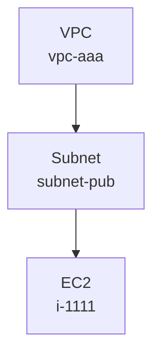

# clew

**English** | [日本語](README_ja.md)

> *A clew through your AWS Config labyrinth.*

`clew` is a Go CLI that ingests AWS Config Configuration Snapshots into a local DuckDB and renders the resulting resource / relationship graph as:

- an interactive HTML page (Cytoscape.js + dagre, with **compound nodes** showing VPC > Subnet > instance nesting like an AWS architecture diagram),
- a Graphviz image (SVG / PNG / JPG / DOT),
- or Mermaid text.

The first supported view targets VPC network topology.

The name *clew* is the Old English word for "ball of thread" — the literal etymology of the modern *clue*, and the thread Ariadne gave Theseus to find his way out of the Labyrinth. The metaphor fits the tool: a thread to follow through the maze of AWS resources and their relationships.

---

## Requirements

- Go 1.21+ (developed on 1.26)
- CGO enabled (`CGO_ENABLED=1`). `marcboeker/go-duckdb` links a C library, so a C compiler (`cc` / `clang`) is required on macOS / Linux.
- AWS CLI (only for downloading snapshots)
- An AWS account with AWS Config enabled (only for downloading snapshots)

## Build

```sh
git clone https://github.com/nishikawaakira/clew.git
cd clew
go build -o clew .
```

For local-only use without a distributed binary, `go run . <subcommand>` works just as well.

Run the tests:

```sh
go test ./...
```

---

## Downloading an AWS Config snapshot

AWS Config delivers Configuration Snapshots to an S3 bucket on a schedule (typically every 6 hours). To get one immediately, call `deliver-config-snapshot`.

### 1. Confirm AWS Config is enabled

```sh
aws configservice describe-configuration-recorders
aws configservice describe-delivery-channels
```

If both `ConfigurationRecorders` and `DeliveryChannels` come back populated, you're set. Otherwise enable AWS Config from the console (Settings → Enable AWS Config), or via CLI: `put-configuration-recorder`, `put-delivery-channel`, then `start-configuration-recorder`.

### 2. Identify the destination S3 bucket

```sh
aws configservice describe-delivery-channels \
  --query 'DeliveryChannels[0].[name,s3BucketName,s3KeyPrefix]' \
  --output text
```

- `name` — Delivery channel name (default: `default`).
- `s3BucketName` — Destination bucket.
- `s3KeyPrefix` — Optional prefix (empty if unset).

### 3. Trigger an immediate snapshot delivery

```sh
aws configservice deliver-config-snapshot \
  --delivery-channel-name default
```

The response contains a `configSnapshotId`. Delivery is asynchronous; the object usually appears in S3 within 10–60 seconds.

> Required IAM permissions: `config:DeliverConfigSnapshot`, `config:DescribeDeliveryChannels`, `config:DescribeConfigurationRecorders`.

### 4. Download the snapshot from S3

Snapshots land at:

```
s3://<bucket>/<optional-prefix>/AWSLogs/<account-id>/Config/<region>/<yyyy>/<mm>/<dd>/ConfigSnapshot/<account-id>_Config_<region>_ConfigSnapshot_<timestamp>_<snapshot-id>.json.gz
```

Example (grab the latest snapshot under a region):

```sh
ACCOUNT_ID=$(aws sts get-caller-identity --query Account --output text)
REGION=ap-northeast-1
BUCKET=<your-bucket>
PREFIX="AWSLogs/${ACCOUNT_ID}/Config/${REGION}/"

# List snapshots under the region (newest at the bottom)
aws s3 ls "s3://${BUCKET}/${PREFIX}" --recursive \
  | grep ConfigSnapshot | sort

# Download the most recent one
KEY=$(aws s3 ls "s3://${BUCKET}/${PREFIX}" --recursive \
        | grep ConfigSnapshot | sort | tail -n 1 | awk '{print $4}')
aws s3 cp "s3://${BUCKET}/${KEY}" ./snapshot.json.gz
```

AWS Config keys use unpadded month / day (`.../2026/5/20/...`), so listing with `--recursive` and `grep ConfigSnapshot | sort | tail` is more portable than building the path with shell `date` formatting (BSD vs GNU date differ on `%-m` / `%-d`).

> Required IAM permissions: `s3:ListBucket`, `s3:GetObject` (on the relevant bucket / keys).

### 5. (Optional) Inspect the snapshot locally

```sh
gunzip -k snapshot.json.gz
jq '.configurationItems | length' snapshot.json
jq '.configurationItems[0]' snapshot.json
```

`clew import` accepts both `.json` and `.json.gz` directly, so you don't have to decompress first.

---

## Usage

### `import` — load a snapshot into DuckDB

```sh
clew import \
  --input snapshot.json.gz \
  --db config.duckdb
```

- `--input` accepts either `.json` or `.json.gz` (detected automatically from the file's content).
- `--db` is created if it doesn't exist; otherwise rows are appended.
- **Idempotency.** Re-importing the same snapshot into the same DB never produces duplicate rows.
  - `config_items.item_id` is a `PRIMARY KEY` of the form `account_id:aws_region:resource_type:resource_id:captureTime`, and inserts use `ON CONFLICT (item_id) DO NOTHING`. Re-importing the **same** snapshot is therefore a no-op.
  - Snapshots captured at **different** times for the same resource yield distinct `item_id`s and are stored as separate rows, preserving history.
  - `graph_nodes` / `graph_edges` always reflect the latest state (real nodes via UPSERT; placeholders and edges via DO NOTHING).
- **Legacy databases.** DBs created by older versions of `clew` (and its previous name `aws-config-graph`) used a non-PK `config_items` schema and a shorter `item_id` format. `clew` auto-migrates them in place on `Open()` — the upgrade is transactional, walks the legacy table in bounded `rowid`-paginated batches, and collapses legacy duplicates via `ON CONFLICT DO NOTHING`.

### `render` — output a diagram

```sh
# Interactive HTML (recommended; zoom / pan / click for details)
clew render --db config.duckdb --view vpc --format html --output vpc.html
open vpc.html   # opens in your default browser

# Static SVG (for embedding in docs / GitHub Markdown)
clew render --db config.duckdb --view vpc --format svg --output vpc.svg

# PNG (for Slack / Notion / slide decks)
clew render --db config.duckdb --view vpc --format png --output vpc.png

# Mermaid (for embedding inside Markdown / opening on mermaid.live)
clew render --db config.duckdb --view vpc --format mermaid --output vpc.md

# Graphviz DOT (if you want to post-process with another tool)
clew render --db config.duckdb --view vpc --format dot --output vpc.dot
```

- The only supported view is `vpc` (for now).
- `--format`: `html` / `mermaid` / `dot` / `svg` / `png` / `jpg`. Default: `html`.
- Omit `--output` to write to stdout. `png` / `jpg` refuse stdout to avoid garbling terminals — supply `--output`.
- `--with-edge-labels` annotates edges with their relationship names. (The HTML page also has a UI toggle for this.)
- `--layout` selects the Graphviz layout engine (`dot` / `neato` / `fdp` / `circo` / `twopi`). Ignored by HTML / Mermaid.

**Choosing a format**

| Format | Best for | Notes |
|---|---|---|
| `html` | Exploring the graph interactively | **Architecture-diagram-style layout**: VPCs contain subnets, subnets contain instances (compound nodes). Hierarchical dagre layout, zoom / pan / click-to-inspect, direction (TB/LR/BT/RL) toggle. Loads Cytoscape.js + cytoscape-dagre from a CDN at view time, so the browser needs network access. |
| `svg` | Embedding a static diagram in docs | Vector. Renders directly in GitHub and browsers. |
| `png` / `jpg` | Slack / Notion / slide decks | Raster, fixed size. |
| `mermaid` | Embedding in Markdown | GitHub README and similar renderers display it inline. |
| `dot` | Hand-off to other Graphviz tooling (gephi etc.) | Plain text. |

Image formats (`svg` / `png` / `jpg` / `dot`) go through `goccy/go-graphviz`, which bundles Graphviz via WASM (wazero). **No system `graphviz` package is required.** The HTML output is a self-contained file that pulls Cytoscape.js / dagre / cytoscape-dagre from a CDN when opened (an offline build mode is a future enhancement).

Mermaid example:

````markdown

````

### `query` — inspect the neighborhood of a specific resource

```sh
clew query \
  --db config.duckdb \
  --resource-id vpc-aaa \
  --depth 2 \
  --format html \
  --output vpc-neighborhood.html
```

- `--depth 0` returns just the seed node.
- `--format`: `html` / `mermaid` / `dot` / `svg` / `png` / `jpg` / `text` (default `html`).
- `--with-edge-labels` defaults to on for HTML / Mermaid / Graphviz output.
- `text` is a plain-text summary suitable for terminals.

---

## Data model

Tables created in the DuckDB file:

| Table | Purpose |
|---|---|
| `config_items` | One row per imported configurationItem, with the original `configuration` / `relationships` / `tags` / full `raw_json`. |
| `graph_nodes` | One row per resource (including placeholders for resources only referenced by relationships). |
| `graph_edges` | Resource-to-resource edges (from both `relationships` arrays and the configuration body). |

- `node_id` format: `account_id:aws_region:resource_type:resource_id`.
- `edge_id`: `SHA256(source_node_id | relationship_name | target_node_id)`.
- `config_items.item_id` format: `account_id:aws_region:resource_type:resource_id:captureTime` (RFC3339Nano, UTC). The PRIMARY KEY combined with `ON CONFLICT DO NOTHING` makes re-importing the same snapshot a no-op while still preserving distinct-time snapshots side by side.

A row in `graph_nodes` with `properties_json` containing `{"placeholder": true}` is a resource that's been referenced by another resource's relationships but has not itself been imported as a configurationItem.

Resource types currently used by the VPC view:

- `AWS::EC2::VPC` / `Subnet` / `RouteTable` / `InternetGateway` / `NatGateway`
- `AWS::EC2::SecurityGroup` / `NetworkInterface` / `Instance`
- `AWS::ElasticLoadBalancingV2::LoadBalancer` / `TargetGroup`
- `AWS::RDS::DBInstance`
- `AWS::Lambda::Function`

Unrecognised resource types are still stored in `graph_nodes` but do not appear in `render --view vpc`.

---

## Limitations (PoC scope)

- `view` is limited to `vpc`.
- `format` is one of `html` / `mermaid` / `dot` / `svg` / `png` / `jpg` (plus `text` for `query`).
- HTML output loads Cytoscape.js + cytoscape-dagre from a CDN, so the HTML file itself is self-contained but viewing it in a browser requires network access.
- Configuration-derived edges cover only the resource types listed in the PoC spec (SG rule SG references, Lambda VPC config, etc.).
- Cross-account / cross-region edges are not created unless explicitly listed in the source relationships.
- No parallelism or appender-API optimisation for very large snapshots — works correctly but uses straightforward prepared-statement inserts.
