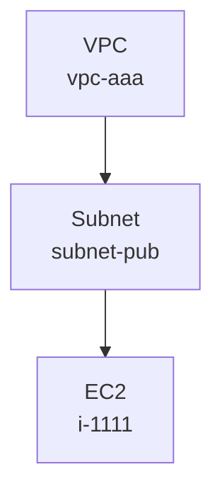

# aws-config-graph

AWS Config の Configuration Snapshot を読み込み、リソースをノード／関係をエッジとして DuckDB に保存し、Mermaid 形式で構成図を出力する PoC CLI です。最初は VPC ネットワーク構成の可視化に焦点を当てています。

---

## 必要要件

- Go 1.21+ (実装は 1.26 で動作確認)
- CGO 有効 (`CGO_ENABLED=1`)。`marcboeker/go-duckdb` は CGO に依存するため macOS/Linux ともに C コンパイラ (`cc` / `clang`) が必要です。
- AWS CLI (snapshot を取得する場合のみ)
- AWS Config が有効化されたアカウント (snapshot を取得する場合のみ)

## ビルド

```sh
git clone <this repo>
cd aws-config-graph
go build -o aws-config-graph .
```

ローカル実行のみで配布バイナリを作らない場合は `go run . <subcommand>` でも構いません。

テストの実行:

```sh
go test ./...
```

---

## AWS Config Snapshot のダウンロード手順

AWS Config の Configuration Snapshot は、有効化済みアカウントから S3 バケットへ定期 (通常 6 時間ごと) に配信されます。即時に必要な場合は `deliver-config-snapshot` を呼び出して配信をトリガーします。

### 1. AWS Config が有効化されているか確認

```sh
aws configservice describe-configuration-recorders
aws configservice describe-delivery-channels
```

`ConfigurationRecorders` と `DeliveryChannels` が両方返ってくれば有効化済みです。返ってこない場合はマネジメントコンソールから「設定」→「AWS Config を有効化」を行ってください (CLI で行う場合は `put-configuration-recorder` / `put-delivery-channel` / `start-configuration-recorder` を順に実行)。

### 2. 配信先 S3 バケット名を確認

```sh
aws configservice describe-delivery-channels \
  --query 'DeliveryChannels[0].[name,s3BucketName,s3KeyPrefix]' \
  --output text
```

- `name` — Delivery channel 名 (デフォルトは `default`)
- `s3BucketName` — 配信先バケット
- `s3KeyPrefix` — 任意のプレフィックス (未設定なら空)

### 3. Snapshot 配信を即時トリガー

```sh
aws configservice deliver-config-snapshot \
  --delivery-channel-name default
```

レスポンスとして `configSnapshotId` が返ります。配信は非同期で、S3 に現れるまで通常 10〜60 秒ほどかかります。

> 必要な IAM 権限: `config:DeliverConfigSnapshot`, `config:DescribeDeliveryChannels`, `config:DescribeConfigurationRecorders`

### 4. S3 から snapshot をダウンロード

snapshot は以下のキー形式で配置されます。

```
s3://<bucket>/<optional-prefix>/AWSLogs/<account-id>/Config/<region>/<yyyy>/<mm>/<dd>/ConfigSnapshot/<account-id>_Config_<region>_ConfigSnapshot_<timestamp>_<snapshot-id>.json.gz
```

例 (リージョン配下から最新の snapshot を 1 件取得):

```sh
ACCOUNT_ID=$(aws sts get-caller-identity --query Account --output text)
REGION=ap-northeast-1
BUCKET=<your-bucket>
PREFIX="AWSLogs/${ACCOUNT_ID}/Config/${REGION}/"

# 当該リージョン以下の snapshot 一覧 (新しいものほど末尾)
aws s3 ls "s3://${BUCKET}/${PREFIX}" --recursive \
  | grep ConfigSnapshot | sort

# 最新の 1 件をダウンロード
KEY=$(aws s3 ls "s3://${BUCKET}/${PREFIX}" --recursive \
        | grep ConfigSnapshot | sort | tail -n 1 | awk '{print $4}')
aws s3 cp "s3://${BUCKET}/${KEY}" ./snapshot.json.gz
```

AWS Config の S3 キーは月日が zero-pad されない形式 (`.../2026/5/20/...`) のため、シェルの `date` フォーマットに依存せず `--recursive` で列挙して `grep ConfigSnapshot | sort | tail` する方が macOS/Linux 共に安全です。

> 必要な IAM 権限: `s3:ListBucket`, `s3:GetObject` (対象バケット／キー)

### 5. (任意) ローカルで展開して中身を確認

```sh
gunzip -k snapshot.json.gz
jq '.configurationItems | length' snapshot.json
jq '.configurationItems[0]' snapshot.json
```

`aws-config-graph import` は `.json` と `.json.gz` のいずれも受け付けるので展開する必要はありません。

---

## 使い方

### import — DuckDB に取り込む

```sh
aws-config-graph import \
  --input snapshot.json.gz \
  --db config.duckdb
```

- `--input` は `.json` / `.json.gz` のいずれも可 (内容を見て自動判定)
- `--db` が存在しなければ新規作成、存在すれば追記
- 同一 `node_id` / `edge_id` は冪等に UPSERT/DO NOTHING されるので、複数回 import しても重複は発生しません

### render — 構成図を出力する

```sh
# SVG (推奨。GitHub / ブラウザでそのまま表示可)
aws-config-graph render --db config.duckdb --view vpc --format svg --output vpc.svg

# PNG (Slack / Notion / スライドへの貼り付け向け)
aws-config-graph render --db config.duckdb --view vpc --format png --output vpc.png

# Mermaid (Markdown 内に埋め込む / mermaid.live で開く)
aws-config-graph render --db config.duckdb --view vpc --format mermaid --output vpc.md

# Graphviz DOT (他ツールで再加工したい場合)
aws-config-graph render --db config.duckdb --view vpc --format dot --output vpc.dot
```

- 現状サポートしている view は `vpc` のみ
- `--format` は `mermaid` / `dot` / `svg` / `png` / `jpg` (デフォルト: `mermaid`)
- `--output` を省略すると標準出力。`png` / `jpg` はターミナルが化けないように `--output` 必須
- `--with-edge-labels` を付けるとエッジに relationship 名が付きます
- `--layout` で Graphviz レイアウトエンジン (`dot` / `neato` / `fdp` / `circo` / `twopi`) を切替可能。デフォルトは階層レイアウトの `dot`

画像系 (`svg` / `png` / `jpg` / `dot`) は `goccy/go-graphviz` 経由の WASM 同梱 Graphviz でレンダリングします。**外部の `graphviz` インストールは不要** です。

Mermaid 出力例:

````markdown

````

### query — 特定リソースの周辺を確認する

```sh
aws-config-graph query \
  --db config.duckdb \
  --resource-id vpc-aaa \
  --depth 2 \
  --format svg \
  --output vpc-neighborhood.svg
```

- `--depth 0` は seed のみ
- `--format` は `mermaid` / `dot` / `svg` / `png` / `jpg` / `text` を切替可 (デフォルト: `mermaid`)
- Mermaid/Graphviz 出力時は `--with-edge-labels` がデフォルト on (relationship 名がエッジに付く)
- `text` は端末向けのプレーンテキストサマリです

---

## データモデル

DuckDB に作成されるテーブル:

| テーブル | 用途 |
|---|---|
| `config_items` | 取り込んだ configurationItem ごとの raw / configuration / relationships / tags |
| `graph_nodes` | リソース 1 件 = 1 row (placeholder を含む) |
| `graph_edges` | リソース間関係 (relationship 由来 + configuration 由来) |

`node_id` の形式: `account_id:aws_region:resource_type:resource_id`
`edge_id`: `SHA256(source_node_id | relationship_name | target_node_id)`

`graph_nodes.properties_json` に `{"placeholder": true}` が入っているノードは、リレーションシップから参照されているがまだ実体としては取り込まれていないリソースを示します。

VPC ビューで参照する resource type:

- `AWS::EC2::VPC` / `Subnet` / `RouteTable` / `InternetGateway` / `NatGateway`
- `AWS::EC2::SecurityGroup` / `NetworkInterface` / `Instance`
- `AWS::ElasticLoadBalancingV2::LoadBalancer` / `TargetGroup`
- `AWS::RDS::DBInstance`
- `AWS::Lambda::Function`

未対応の resource type は `graph_nodes` には保存されますが、`render --view vpc` には登場しません。

---

## 制限事項 (PoC スコープ)

- `view` は `vpc` のみ
- `format` は `mermaid` / `dot` / `svg` / `png` / `jpg` / (query のみ) `text`
- configuration からのエッジ抽出は仕様書に列挙された範囲のみ (SG ルール内 SG 参照、Lambda VPC config 等)
- アカウント / リージョンを跨ぐエッジは relationship に明示されていないため作成されません
- 大規模 snapshot 向けの並列化や appender API は未対応 (動作はしますが速度は素朴な prepared statement 経由です)
